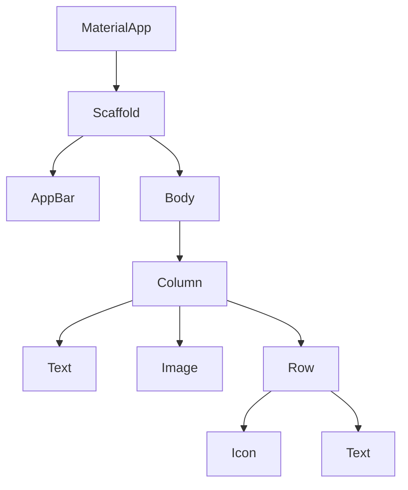

# Hafta-09 - Flutter’a Giriş ve Temel Widget'lar

Konu: Flutter kurulum kısa hatırlatma, `main.dart`, `MaterialApp`, `Scaffold`, temel widget'lar (Text, Image, Icon, Row, Column, Container).

Hedef: Basit bir Flutter uygulaması oluşturup widget tree yapısını öğrenmek.

## Widget Tree (basit)



---

## Örnek 1 — `main.dart` temel yapı

```dart
import 'package:flutter/material.dart';

void main() => runApp(const MyApp());

class MyApp extends StatelessWidget {
  const MyApp({super.key});

  @override
  Widget build(BuildContext context) {
    return MaterialApp(
      title: 'Flutter Ders',
      home: Scaffold(
        appBar: AppBar(title: const Text('Hafta 09')),
        body: const Center(child: Text('Merhaba Flutter!')),
      ),
    );
  }
}
```

## Örnek 2 — `Container` ve stil

```dart
Container(
  width: 200,
  height: 100,
  color: Colors.blue,
  child: const Center(child: Text('Mavi kutu', style: TextStyle(color: Colors.white))),
)
```

## Örnek 3 — `Row` ve `Column` kullanımı

```dart
Column(
  children: [
    Text('Satır 1'),
    Row(
      mainAxisAlignment: MainAxisAlignment.center,
      children: [Icon(Icons.star), Text('Yıldız')],
    ),
  ],
)
```

## Örnek 4 — `Image` (network)

```dart
Image.network('https://picsum.photos/200/150')
```

## Örnek 5 — Basit `RaisedButton` (ElevatedButton)

```dart
ElevatedButton(
  onPressed: () { print('Butona basıldı'); },
  child: const Text('Tıkla'),
)
```

---

Notlar:
- `StatelessWidget` ve `StatefulWidget` arasındaki temel fark: durum yönetimi (state) ihtiyacı.

