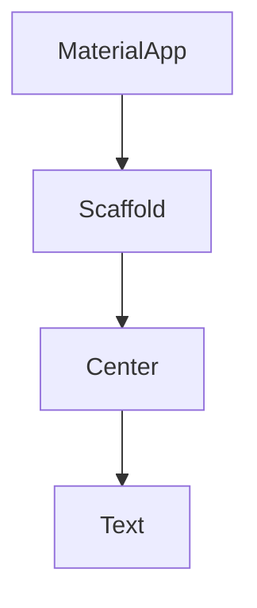
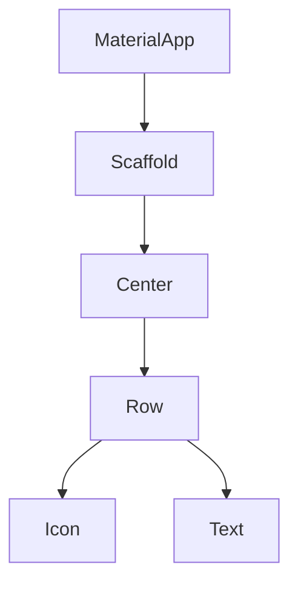
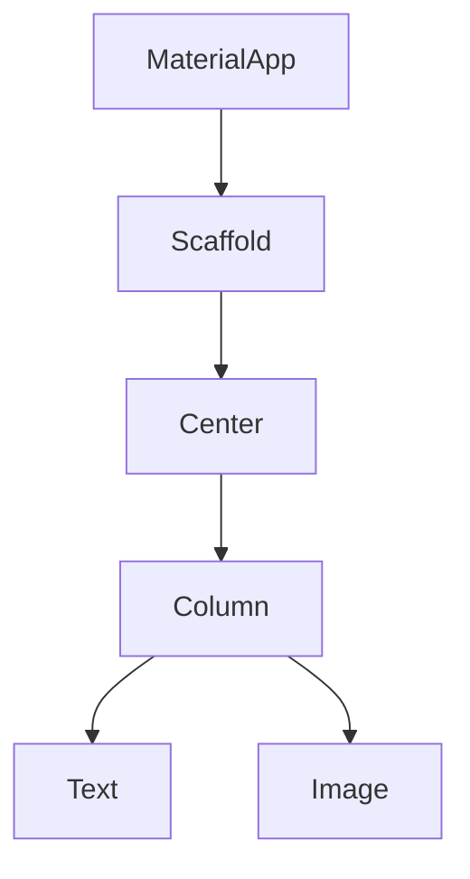
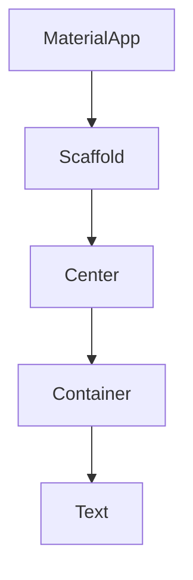
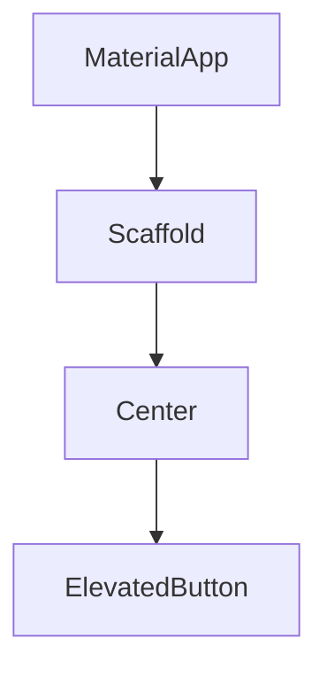

# Flutter Widget Ağacı ve Kod Örnekleri

Bu dosyada, temel Flutter kod örnekleri için önce ilgili widget ağacı (Mermaid diyagramı ile), ardından kodu bulacaksınız. Her örnek, widget hiyerarşisini ve kodun yapısını anlamanızı kolaylaştırmak için hazırlanmıştır.

## Sık Kullanılan Widgetler ve Açıklamaları

- **MaterialApp**: Uygulamanın kök widget'ı, tema ve yönlendirme gibi temel ayarları sağlar.
- **Scaffold**: Temel sayfa yapısı (app bar, body, floating action button vb.) sunar.
- **Center**: İçindeki widget'ı dikey ve yatayda ortalar.
- **Text**: Ekranda metin gösterir.
- **Row**: Yatayda birden fazla widget'ı yan yana dizer.
- **Column**: Dikeyde birden fazla widget'ı alt alta dizer.
- **Icon**: Simgeleri gösterir.
- **Image**: Görsel (resim) gösterir.
- **Container**: Kutu şeklinde alan oluşturur, boyut ve stil verebiliriz.
- **ElevatedButton**: Tıklanabilir buton, onPressed ile etkileşim eklenir.


---

## Örnek 1: Basit Text Widget

### Widget Ağacı


### Flutter Kodu
```dart
import 'package:flutter/material.dart';

void main() => runApp(const MyApp());

class MyApp extends StatelessWidget {
  const MyApp({super.key});

  @override
  Widget build(BuildContext context) {
    return MaterialApp(
      home: Scaffold(
        body: Center(
          child: Text('Merhaba Flutter!'),
        ),
      ),
    );
  }
}

```


---

## Örnek 2: Row ve Icon

### Widget Ağacı


### Flutter Kodu
```dart
MaterialApp(
  home: Scaffold(
    body: Center(
      child: Row(
        mainAxisAlignment: MainAxisAlignment.center,
        children: [
          Icon(Icons.star, color: Colors.amber),
          Text('Yıldızlı')
        ],
      ),
    ),
  ),
)

```


---

## Örnek 3: Column ve Image

### Widget Ağacı


### Flutter Kodu
```dart
MaterialApp(
  home: Scaffold(
    body: Center(
      child: Column(
        mainAxisAlignment: MainAxisAlignment.center,
        children: [
          Text('Resim aşağıda'),
          Image.network('https://picsum.photos/200/100'),
        ],
      ),
    ),
  ),
)

```


---

## Örnek 4: Container ve Stil

### Widget Ağacı


### Flutter Kodu
```dart
MaterialApp(
  home: Scaffold(
    body: Center(
      child: Container(
        width: 200,
        height: 100,
        color: Colors.blue,
        child: const Center(
          child: Text('Mavi kutu', style: TextStyle(color: Colors.white)),
        ),
      ),
    ),
  ),
)

```


---

## Örnek 5: ElevatedButton ile Etkileşim

### Widget Ağacı


### Flutter Kodu
```dart
MaterialApp(
  home: Scaffold(
    body: Center(
      child: ElevatedButton(
        onPressed: () {
          print('Butona basıldı');
        },
        child: Text('Tıkla'),
      ),
    ),
  ),
)

```


---

Her örnekte önce widget ağacını inceleyin, sonra kodu deneyin. Daha karmaşık örnekler için yeni widget'lar ekleyerek ağacı genişletebilirsiniz.
