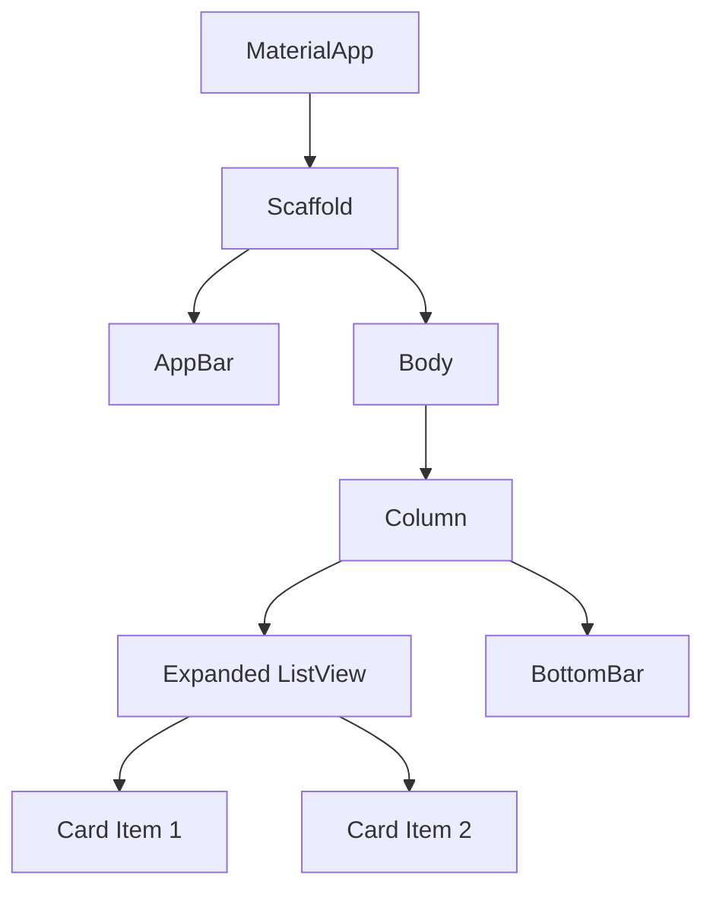

# Hafta-10 - Düzen (Layout) ve Durum (State) Temelleri

Konu: Layout widget'ları (Expanded, Flexible, Padding, Align), `StatelessWidget` ile sabit arayüzler, `ListView`, `Card`. Bu hafta, arayüzde sabit (değişmeyen) yapılar için StatelessWidget kullanımı üzerinde durulacak. Bir sonraki hafta ise StatefulWidget ile dinamik arayüzlere geçiş yapılacak.

Hedef: Ekran düzeni kurmak, sabit arayüzler için StatelessWidget örnekleri görmek ve temel layout widget'larını tanımak.

---

## StatelessWidget ile Basit Örnekler

### Örnek 1 — Sabit Metin

```dart
class SabitMetin extends StatelessWidget {
  const SabitMetin({super.key});

  @override
  Widget build(BuildContext context) {
    return Text('Bu bir StatelessWidget örneğidir.');
  }
}
// Kullanım: Center(child: SabitMetin())
```

### Örnek 2 — Sabit Buton

```dart
class SabitButon extends StatelessWidget {
  const SabitButon({super.key});

  @override
  Widget build(BuildContext context) {
    return ElevatedButton(
      onPressed: null, // Buton pasif, state yok
      child: Text('Stateless Buton'),
    );
  }
}
// Kullanım: Center(child: SabitButon())
```

### Örnek 3 — Sabit Kart

```dart
class SabitKart extends StatelessWidget {
  final String baslik;
  final String aciklama;
  const SabitKart({super.key, required this.baslik, required this.aciklama});

  @override
  Widget build(BuildContext context) {
    return Card(
      child: Padding(
        padding: const EdgeInsets.all(16.0),
        child: Column(
          mainAxisSize: MainAxisSize.min,
          children: [
            Text(baslik, style: const TextStyle(fontWeight: FontWeight.bold)),
            const SizedBox(height: 8),
            Text(aciklama),
          ],
        ),
      ),
    );
  }
}
// Kullanım: SabitKart(baslik: 'Başlık', aciklama: 'Açıklama')
```

---

## Widget Tree (örnek bir liste uygulaması)



---

## Örnek 1 — `Padding` ve `Align`

```dart
Padding(
  padding: const EdgeInsets.all(16.0),
  child: Align(
    alignment: Alignment.centerLeft,
    child: Text('Sol hizalı metin'),
  ),
)
```

## Örnek 2 — `Expanded` ve `Flexible`

```dart
Row(
  children: [
    Expanded(child: Container(color: Colors.red, height: 100)),
    Flexible(child: Container(color: Colors.green, height: 100)),
  ],
)
```


## Not

Bu hafta sadece sabit (değişmeyen) arayüzler için StatelessWidget kullanımı gösterildi. Dinamik ve değişen arayüzler için bir sonraki hafta (Hafta-11) `StatefulWidget` ile örnekler ve state yönetimi anlatılacaktır.

## Örnek 4 — `ListView.builder`

```dart
ListView.builder(
  itemCount: 20,
  itemBuilder: (context, index) => Card(
    child: ListTile(title: Text('Öğe \\${index+1}')),
  ),
)
```

## Örnek 5 — `Card` içi etkileşim

```dart
Card(
  child: ListTile(
    leading: Icon(Icons.account_circle),
    title: Text('Kullanıcı Adı'),
    trailing: IconButton(icon: Icon(Icons.more_vert), onPressed: () {}),
  ),
)
```

---

Notlar:
- `setState` küçük uygulamalar için yeterlidir; daha karmaşık uygulamalarda state yönetim çözümleri gerekebilir.
- Layout'larda `Expanded` ile alan paylaşımı, `Flexible` ile uyumlu boyutlandırma sağlanır.
